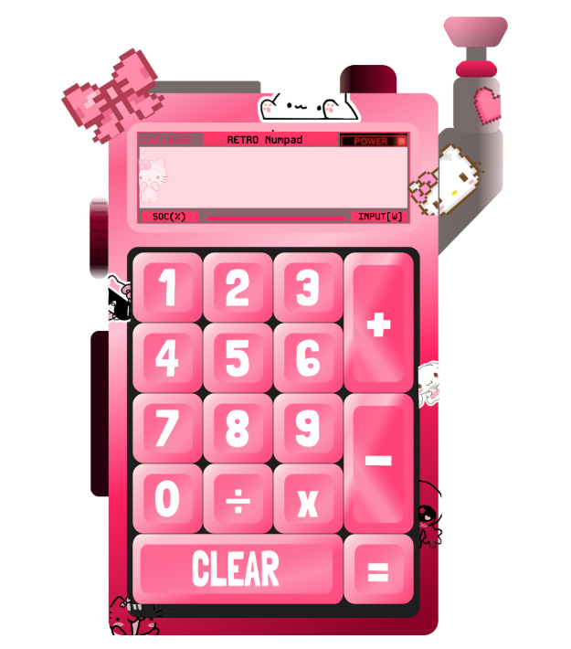

# 🎀 pookie calculator 🎀

A highly customized, ultra-cute, retro-inspired numpad calculator built entirely from scratch using **React**. Every single element—from the custom buttons to the pixel art accents and sticker graphics—was uniquely designed to create the ultimate aesthetic desktop companion.

 ---
 

## ✨ Features

* **Custom-Designed UI:** A unique retro-handheld/numpad aesthetic featuring custom gradients, pixel-art bows, and cute sticker decorations.
* **Fully Functional Numpad:** Perform all your standard calculations (`+`, `-`, `x`, `÷`) with a satisfying, chunky mechanical key-cap feel.
* **Responsive State Management:** Dynamic digital display powered entirely by React.
* **100% Original Assets:** Every single component, icon, and button layout was designed individually for this project.

---

## 🛠️ Tech Stack

* **Frontend Framework:** React.js
* **Styling:** CSS3 / Styled Component by figma
* **Design Tools:** Custom vector/pixel artwork

---

## 🚀 Getting Started

To get a local copy up and running, follow these simple steps:

### Prerequisites

Make sure you have **Node.js** and **npm** installed on your machine.

### Installation

1. **Clone the repository:**
```bash
git clone https://github.com/druknown823-hash/pookie-calculator.git

```


2. **Navigate into the project directory:**
```bash
cd pookie-calculator

```


3. **Install the dependencies:**
```bash
npm install

```


4. **Start the local development server:**
```bash
npm start

```


*The app should automatically open on `http://localhost:3000`!*

---

## 🎨 Design Philosophy

> "Who says math can't be pookie?"

The goal of this project was to break away from standard, boring utility apps and inject maximum personality into a daily tool. It combines elements of retro hardware, y2k digital aesthetics, and cute character designs to make typing out numbers a genuinely fun experience.

---

### ❤️ Acknowledgments

* Shoutout to everyone who loves making software a little more colorful and a lot more cute.
